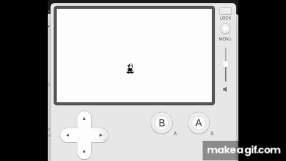

# sk8er-boi

**Status:** Work in Progress (WIP)

**Platform:** Panic Playdate

---

## Overview

_sk8er-boi_ is a skateboarding game in development for the Playdate, featuring pixel-art sprites and a hangar environment filled with obstacles for performing tricks. Drawing inspiration from classic skateboarding titles, this project focuses on tight controls, smooth animations, and a fun trick system.

---

## Features

- **Hangar Environment**: Navigate ramps, rails, and platforms in a custom hangar setting.
- **Trick System**: Perform ollies, flips, grinds, and manuals using simple button inputs.
- **Pixel-Art Sprites**: Retro-style graphics designed specifically for the Playdate’s 400×240 display.
- **Physics & Collision**: Basic physics for jumps, landings, and rail grinds.
- **Audio**: Placeholder chiptune soundtrack and sound effects (using Playdate’s audio API).

---

## Screenshot

---

## Development

- **Languages**:
  - Lua for core gameplay logic.
  - Optional C modules for performance-critical routines (e.g., physics, collision).
- **SDK**:
  - Playdate SDK (using Lua API).
  - Tested on Playdate OS 1.x and up.

---

## Contribution

This project is in active development. Feel free to:

- Report issues and feature requests.
- Submit pull requests for bug fixes, optimized physics, new tricks, or art enhancements.
- Follow Playdate SDK best practices for performance and memory usage.

Before contributing, please ensure your code follows the existing style (Lua + optional C) and that any new assets fit the pixel-art aesthetic.

---

## License

This project is released under the MIT License. See [LICENSE](LICENSE) for details.
